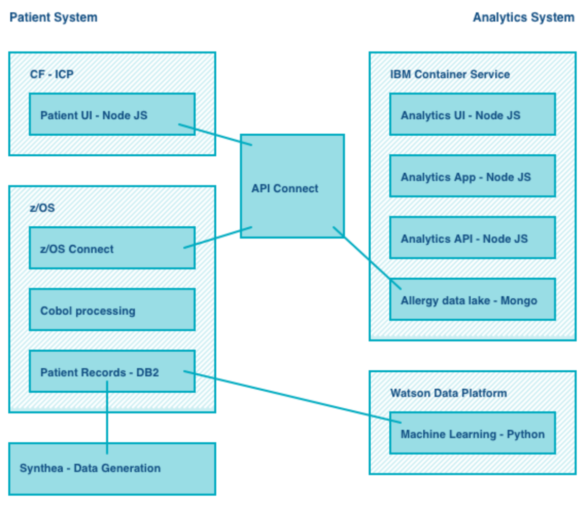
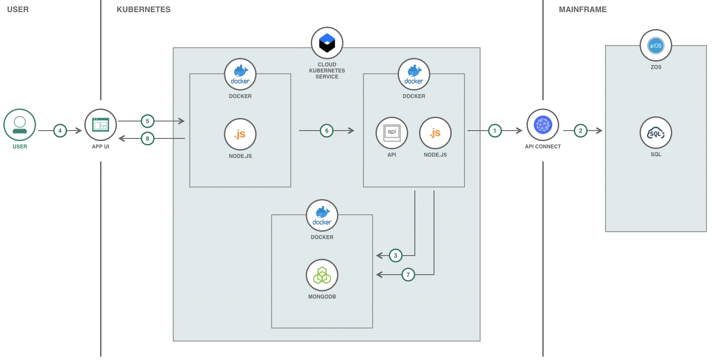
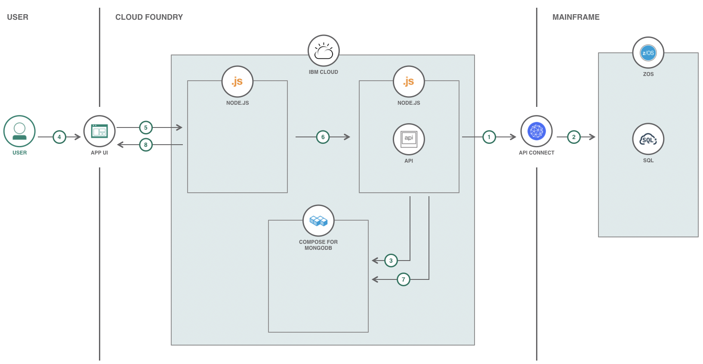
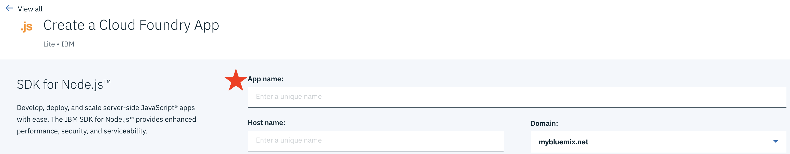
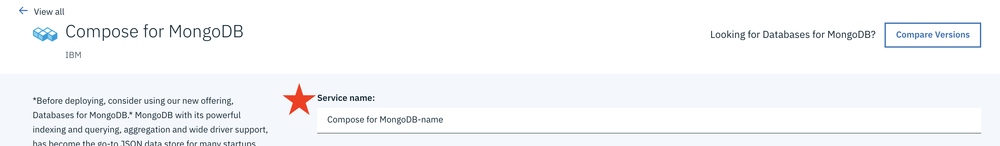
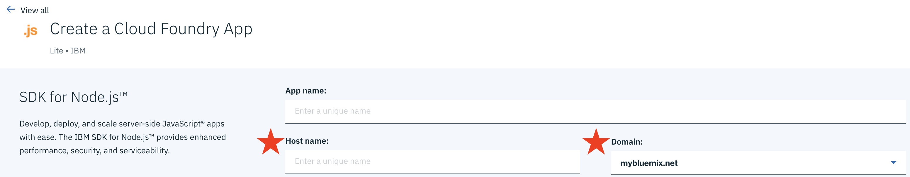
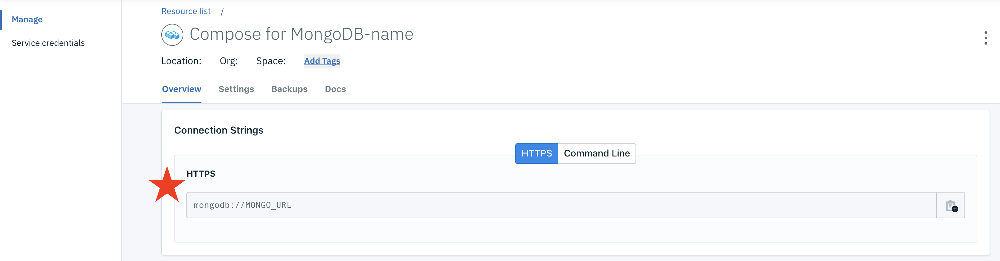
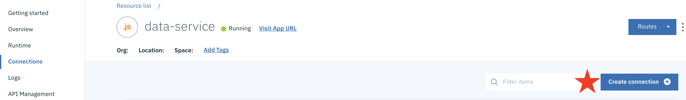

[](https://travis-ci.com/IBM/example-health-analytics)

# Example Health Analytics

This project is a conceptual Node.js analytics web application for a health records system, designed to showcase best in class integration of modern cloud technology, in collaboration with [legacy mainframe code](https://github.com/IBM/example-health-apis).
> NOTE: This project is also compatible with the [Example Health JEE Application on Openshift](https://github.com/IBM/example-health-jee-openshift). See notes below for details.

## Example Health Context

Example Health is a conceptual healthcare/insurance type company. It has been around a long time, and has 100s of thousands of patient records in a SQL database connected to a zOS mainframe. Their health records look very similar to the health records of most insurance companies.

Here's a view a data analyst might see when they interact with the Example Health Analytics Application:


Example Health has recently started understanding how data science/analytics on some of the patient records, might surface interesting insights. There is lots of talk about this among some of the big data companies.

Example Health has also heard a lot about cloud computing. There is a lot of legacy code in the mainframe, and it works well for now, but they think it may be a complimentary opportunity to explore some data science/analytics in the cloud.

Their CTO sees an architecture for Example Health like this:



# Architecture

## Using Kubernetes



## Using Cloud Foundry



1. Data Service API acts as a data pipeline and is triggered for updating data lake with updated health records data by calling API Connect APIs associated with the zOS Mainframe.
2. API Connect APIs process relevant health records data from zOS Mainframe data warehouse and send the data through the data pipeline.
3. The Data Service data pipeline processes zOS Mainframe data warehouse data and updates MongoDB data lake.
4. User interacts with the UI to view and analyze analytics.
5. The functionality of the App UI that the User interacts with is handled by Node.js. Node.js is where the API calls are initialized.
6. The API calls are processed in the Node.js data service and are handled accordingly.
7. The data is gathered from the MongoDB data lake from API calls.
8. The responses from the API calls are handled accordingly by the App UI.

# Steps

Follow these steps to setup and run this code pattern locally and on the Cloud. The steps are described in detail below.

1. [Clone the repo](#1-clone-the-repo)
2. [Prerequisites](#2-prerequisites)
3. [Get Mapbox Access Token](#3-get-mapbox-access-token)
4. [Run the application](#4-run-the-application)
5. [Deploy to IBM Cloud](#5-deploy-to-ibm-cloud)

## 1. Clone the repo

Clone the `example-health-analytics` repo locally. In a terminal, run:

```bash
git clone https://github.com/IBM/example-health-analytics
cd example-health-analytics
```

## 2. Prerequisites

* [Docker](https://www.docker.com/products/docker-desktop)
* [IBM Cloud account](https://cloud.ibm.com/registration)
* [IBM Cloud CLI](https://cloud.ibm.com/docs/cli?topic=cloud-cli-ibmcloud-cli&locale=en-US#overview)

For running these services locally without Docker containers, the following will be needed:

* [MongoDB](https://www.mongodb.com/download-center/v2/community)
* [NodeJS](https://nodejs.org/en/download/)
* [NPM](https://www.npmjs.com/get-npm)
* Relevant Node Components: Use `npm install` in `/data-service` and `/web`

## 3. Get Mapbox Access Token

1. In order to make API calls to help in populating the Mapbox map used, a [Mapbox access token](https://www.mapbox.com/account/access-tokens) will be needed.
2. Assign the access token to `MAPBOX_ACCESS_TOKEN` in [docker-compose.yml](docker-compose.yml).

## 4. Run the application

* [zOS Mainframe Data](#zos-mainframe-data)
* [Generate Data](#generate-data)

### zOS Mainframe Data
> NOTE: If using the [Example Health JEE Application on Openshift](https://github.com/IBM/example-health-jee-openshift) as your data source, follow these steps.

If your data source for this application is on a zOS Mainframe, follow these steps for populating the datalake and running the application:

1. Assign the API Connect URL to `DATA_SOURCE_API` in [docker-compose.yml](docker-compose.yml)
> NOTE: If using the [Example Health JEE Application on Openshift](https://github.com/IBM/example-health-jee-openshift) as your data source, assign that API URL to `DATA_SOURCE_API`
2. Start the application by running `docker-compose up --build` in this repo's root directory.
3. Once the containers are created and the application is running, use the Open API Doc (Swagger) at `http://localhost:3000` and [API.md](data-service/API.md) for instructions on how to use the APIs.
4. Run `curl localhost:3000/api/v1/update -X PUT` to connect to the zOS Mainframe and populate the data lake. For information on the data lake and data service, read the data service [README.md](data-service/README.md).
5. Once the data has been populated in the data lake, use `http://localhost:4000` to access the Example Health Analytics UI. For information on the analytics data and UI, read the web [README.md](web/README.md).

### Generate Data

If you do not have a data source for this application and would like to generate mock data, follow these steps for populating the datalake and running the application:

1. Start the application by running `docker-compose up --build` in this repo's root directory.
2. Once the containers are created and the application is running, use the Open API Doc (Swagger) at `http://localhost:3000` and [API.md](data-service/API.md) for instructions on how to use the APIs.
3. Use the provided `generate/generate.sh` script to generate and populate data. Read [README.md](generate/README.md) for instructions on how to use the script. For information on the data lake and data service, read the data service [README.md](data-service/README.md).
4. Once the data has been populated in the data lake, use `http://localhost:4000` to access the Example Health Analytics UI. For information on the analytics data and UI, read the web [README.md](web/README.md).

## 5. Deploy to IBM Cloud

* [Kubernetes](#kubernetes)
* [Cloud Foundry](#cloud-foundry)

### Kubernetes

1. To allow changes to the Data Service or the UI, create a repo on [Docker Cloud](https://cloud.docker.com/) where the new modified containers will be pushed to.
> NOTE: If a new repo is used for the Docker containers, the container `image` will need to be modified to the name of the new repo used in [deploy-dataservice.yml](deploy-dataservice.yml) and/or [deploy-webapp.yml](deploy-webapp.yml).

```bash
export DOCKERHUB_USERNAME=<your-dockerhub-username>

docker build -t $DOCKERHUB_USERNAME/examplehealthanalyticsdata:latest data-service/
docker build -t $DOCKERHUB_USERNAME/examplehealthanalyticsweb:latest web/

docker login

docker push $DOCKERHUB_USERNAME/examplehealthanalyticsdata:latest
docker push $DOCKERHUB_USERNAME/examplehealthanalyticsweb:latest
```

2. Provision the [IBM Cloud Kubernetes Service](https://cloud.ibm.com/kubernetes/catalog/cluster) and follow the set of instructions for creating a Container and Cluster based on your cluster type, `Standard` vs `Lite`.

* Login to the IBM Cloud using the [Developer Tools CLI](https://www.ibm.com/cloud/cli):
> NOTE use `--sso` if you have a single sign on account, or delete for username/password login

```bash
ibmcloud login --sso
```

* Set the Kubernetes environment to work with your cluster:

```bash
ibmcloud cs cluster-config $CLUSTER_NAME
```

The output of this command will contain a KUBECONFIG environment variable that must be exported in order to set the context. Copy and paste the output in the terminal window. An example is:

```bash
export KUBECONFIG=/home/rak/.bluemix/plugins/container-service/clusters/Kate/kube-config-prod-dal10-<cluster_name>.yml
```

#### Lite Cluster Instructions

3. Get the workers for your Kubernetes cluster:

```bash
ibmcloud cs workers <mycluster>
```
and locate the `Public IP`. This IP is used to access the Data Service and UI on the Cloud. Update the `env` values for `HOST_IP` in [deploy-dataservice.yml](deploy-dataservice.yml) to `<Public IP>:32000` and `DATA_SERVER` in [deploy-webapp.yml](deploy-webapp.yml) to `http://<Public IP>:32000`. Also in [deploy-dataservice.yml](deploy-dataservice.yml), update the `env` value for `SCHEME` to `http`.

4. Assign the Mapbox access token to `MAPBOX_ACCESS_TOKEN` in [deploy-dataservice.yml](deploy-dataservice.yml) and [deploy-webapp.yml](deploy-webapp.yml). If your data source for this application is on a zOS Mainframe, assign the API Connect URL to `DATA_SOURCE_API` in [deploy-dataservice.yml](deploy-dataservice.yml).
> NOTE: If using the [Example Health JEE Application on Openshift](https://github.com/IBM/example-health-jee-openshift) as your data source, assign that API URL to `DATA_SOURCE_API`

5. To deploy the services to the IBM Cloud Kubernetes Service, run:

```bash
kubectl apply -f deploy-mongodb.yml
kubectl apply -f deploy-dataservice.yml
kubectl apply -f deploy-webapp.yml

## Confirm the services are running - this may take a minute
kubectl get pods
```

6. Use `http://PUBLIC_IP:32001` to access the UI and the Open API Doc (Swagger) at `http://PUBLIC_IP:32000` for instructions on how to make API calls.

#### Standard Cluster Instructions

3. Run `ibmcloud cs cluster-get <CLUSTER_NAME>` and locate the `Ingress Subdomain` and `Ingress Secret`. This is the domain of the URL that is to be used to access the Data Service and UI on the Cloud. Update the `env` values for  `HOST_IP` in [deploy-dataservice.yml](deploy-dataservice.yml) to `api.<Ingress Subdomain>` and `DATA_SERVER` in [deploy-webapp.yml](deploy-webapp.yml) to `https://api.<Ingress Subdomain>`. Also in [deploy-dataservice.yml](deploy-dataservice.yml), update the `env` value for `SCHEME` to `https`. In addition, update the `host` and `secretName` in [ingress-dataservice.yml](ingress-dataservice.yml) and [ingress-webapp.yml](ingress-webapp.yml) to `Ingress Subdomain` and `Ingress Secret`.

4. Assign the Mapbox access token to `MAPBOX_ACCESS_TOKEN` in [deploy-dataservice.yml](deploy-dataservice.yml) and [deploy-webapp.yml](deploy-webapp.yml). If your data source for this application is on a zOS Mainframe, assign the API Connect URL to `DATA_SOURCE_API` in [deploy-dataservice.yml](deploy-dataservice.yml).
> NOTE: If using the [Example Health JEE Application on Openshift](https://github.com/IBM/example-health-jee-openshift) as your data source, assign that API URL to `DATA_SOURCE_API`

5. To deploy the services to the IBM Cloud Kubernetes Service, run:

```bash
kubectl apply -f deploy-mongodb.yml
kubectl apply -f deploy-dataservice.yml
kubectl apply -f deploy-webapp.yml

## Confirm the services are running - this may take a minute
kubectl get pods

## Update protocol being used to https
kubectl apply -f ingress-dataservice.yml
kubectl apply -f ingress-webapp.yml
```

6. Use `https://<INGRESS_SUBDOMAIN>` to access the UI and the Open API Doc (Swagger) at `https://api.<INGRESS_SUBDOMAIN>` for instructions on how to make API calls.

### Cloud Foundry

1. Provision two [SDK for Node.js](https://cloud.ibm.com/catalog/starters/sdk-for-nodejs) applications. One will be for `./data-service` and the other will be for `./web`.

2. Provision a [Compose for MongoDB](https://cloud.ibm.com/catalog/services/compose-for-mongodb) database.

3. Update the following in the [manifest.yml](manifest.yml) file:


* `name` for both Cloud Foundry application names provisioned from Step 1.




* `services` with the name of the MongoDB service provisioned from Step 2.




* `HOST_IP` and `DATA_SERVER` with the host name and domain of the `data-service` from Step 1.




* `MONGODB` with the HTTPS Connection String of the MongoDB provisioned from Step 2. This can be found under *Manage > Overview* of the database dashboard.



* `MAPBOX_ACCESS_TOKEN` with the Mapbox access token.

* `DATA_SOURCE_API` with the API Connect URL if your data source for this application is on a zOS Mainframe.
> NOTE: If using the [Example Health JEE Application on Openshift](https://github.com/IBM/example-health-jee-openshift) as your data source, assign that API URL to `DATA_SOURCE_API`

4. Connect the Compose for MongoDB database with the data service Node.js app by going to *Connections* on the dashboard of the data service app provisioned and clicking *Create Connection*. Locate the Compose for MongoDB database you provisioned and press *connect*.



5. To deploy the services to IBM Cloud Foundry, go to one of the dashboards of the apps provisioned from Step 1 and follow the *Getting Started* instructions for connecting and logging in to IBM Cloud from the console (Step 3 of *Getting Started*). Once logged in, run `ibmcloud app push` from the root directory.

6. Use `https://<WEB-HOST-NAME>.<WEB-DOMAIN>` to access the UI and the Open API Doc (Swagger) at `https://<DATA-SERVICE-HOST-NAME>.<DATA-SERVICE-DOMAIN>` for instructions on how to make API calls.

# License

This code pattern is licensed under the Apache License, Version 2. Separate third-party code objects invoked within this code pattern are licensed by their respective providers pursuant to their own separate licenses. Contributions are subject to the [Developer Certificate of Origin, Version 1.1](https://developercertificate.org/) and the [Apache License, Version 2](https://www.apache.org/licenses/LICENSE-2.0.txt).

[Apache License FAQ](https://www.apache.org/foundation/license-faq.html#WhatDoesItMEAN)
