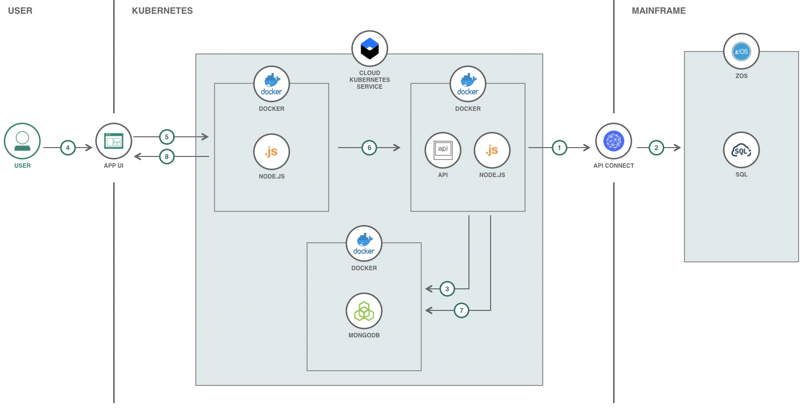

[](https://travis-ci.com/IBM/summit-health-analytics)

# Summit Health Analytics

This project is a conceptual Node.JS analytics web application for a health records system, designed to showcase best in class integration of modern cloud technology, in collaboration with legacy mainframe code.

## Summit Health Context

Summit Health is a conceptual healthcare/insurance type company. It has been around a long time, and has 100s of thousands of patient records in a SQL database connected to a zOS mainframe.

Summit's health records look very similar to the health records of most insurance companies.

Here's a view a data analyst might see when they inteact with the Summit Health Analytics Application:

<!--Diagram-->

Summit has recently started understanding how data science/analytics on some of the patient records, might surface interesting insights. There is lots of talk about this among some of the big data companies.

Summit has also heard a lot about cloud computing. There is a lot of legacy code in the mainframe, and it works well for now, but Summit thinks it may be a complimentary opportunity to explore some data science/analytics in the cloud.

Their CTO sees an architecture for Summit Health like this:


# Architecture



1. Data Service API acts as a data pipeline and is triggered for updating data lake with updated health records data by calling API Connect APIs associated with the zOS Mainframe.
2. API Connect APIs process relevant health records data from zOS Mainframe data warehouse and send the data through the data pipeline.
3. The Data Service data pipeline processes zOS Mainframe data warehouse data and updates MongoDB data lake.
4. User interacts with the UI to view and analyze analytics.
5. The functionality of the App UI that the User interacts with is handled by Node.JS. Node.JS is where the API calls are initialized.
6. The API calls are processed in the Node.JS data service on Kubernetes and are handled accordingly.
7. The data is gathered from the MongoDB data lake from API calls.
8. The responses from the API calls are handled accordingly by the App UI.

# Steps

Follow these steps to setup and run this code pattern locally and on the Cloud. The steps are described in detail below.

1. [Prerequisites](#1-prerequisites)
2. [Clone the repo](#2-clone-the-repo)
3. [Run the application](#3-run-the-application)
4. [Deploy to IBM Cloud](#4-deploy-to-ibm-cloud)

## 1. Prerequisites

* [Docker](https://www.docker.com/products/docker-desktop)
* [IBM Cloud Kubernetes Service Provisioned](https://www.ibm.com/cloud/container-service)

For running these services locally without Docker containers, the following will be needed:

* [MongoDB](https://www.mongodb.com/download-center/v2/community)
* [NodeJS](https://nodejs.org/en/download/)
* [NPM](https://www.npmjs.com/get-npm)
* Relevant Node Components: Use `npm install` in `/data-service` and `/web`

## 2. Clone the repo

Clone the `summit-health-analytics` repo locally. In a terminal, run:

```
$ git clone https://github.com/IBM/summit-health-analytics
$ cd summit-health-analytics
```

## 3. Run the application

1. Start the application by running `docker-compose up --build` in this repo's root directory.
2. Once the containers are created and the application is running, use the Open API Doc (Swagger) at `http://localhost:3000` and [API.md](data-service/API.md) for instructions on how to use the APIs.
3. Use the provided `generate/generate.sh` script to generate and populate data. Use [README.md](generate/README.md) for instructions on how to use the script.
4. Once the data has been populated in the data lake, use `http://localhost:4000` to access the Summit Health Analytics UI.

## 4. Deploy to IBM Cloud

1. To allow changes to the Data Service or the UI, create a repo on [Docker Cloud](https://cloud.docker.com/) where the new modified containers will be pushed to. 
> NOTE: If a new repo is used for the Docker containers, the container `image` will need to be modified to the name of the new repo used in [deploy-dataservice.yml](deploy-dataservice.yml) and/or [deploy-webapp.yml](deploy-webapp.yml).

```
$ export DOCKERHUB_USERNAME=<your-dockerhub-username>

$ docker build -t $DOCKERHUB_USERNAME/summithealthanalyticsdata:latest data-service/
$ docker build -t $DOCKERHUB_USERNAME/summithealthanalyticsweb:latest web/

$ docker login

$ docker push $DOCKERHUB_USERNAME/summithealthanalyticsdata:latest
$ docker push $DOCKERHUB_USERNAME/summithealthanalyticsweb:latest
```

2. Provision the [IBM Cloud Kubernetes Service](https://www.ibm.com/cloud/container-service) and follow the set of instructions for creating a Container and Cluster based on your cluster type, `Standard` vs `Lite`.

### Lite Cluster Instructions

3. Run `bx cs workers mycluster` and locate the `Public IP`. This IP is used to access the worklog API and UI (Flask Application). Update the `env` values in both [deploy-dataservice.yml](deploy-dataservice.yml) and [deploy-webapp.yml](deploy-webapp.yml) to the `Public IP`.

4. To deploy the services to the IBM Cloud Kubernetes Service, run:

```
$ kubectl apply -f deploy-mongodb.yml
$ kubectl apply -f deploy-dataservice.yml
$ kubectl apply -f deploy-webapp.yml

## Confirm the services are running - this may take a minute
$ kubectl get pods
```

5. Use `https://PUBLIC_IP:32001` to access the UI and the Open API Doc (Swagger) at `https://PUBLIC_IP:32000` for instructions on how to make API calls.

### Standard Cluster Instructions

3. Run `bx cs cluster-get <CLUSTER_NAME>` and locate the `Ingress Subdomain` and `Ingress Secret`. This is the domain of the URL that is to be used to access the Data Service and UI on the Cloud. Update the `env` values in both [deploy-dataservice.yml](deploy-dataservice.yml) and [deploy-webapp.yml](deploy-webapp.yml) to the `Ingress Subdomain`. In addition, update the `host` and `secretName` in [ingress-dataservice.yml](ingress-dataservice.yml) and [ingress-webapp.yml](ingress-webapp.yml) to `Ingress Subdomain` and `Ingress Secret`.

4. To deploy the services to the IBM Cloud Kubernetes Service, run:

```
$ kubectl apply -f deploy-mongodb.yml
$ kubectl apply -f deploy-dataservice.yml
$ kubectl apply -f deploy-webapp.yml

## Confirm the services are running - this may take a minute
$ kubectl get pods

## Update protocol being used to https
$ kubectl apply -f ingress-dataservice.yml
$ kubectl apply -f ingress-webapp.yml
```

5. Use `https://<INGRESS_SUBDOMAIN>` to access the UI and the Open API Doc (Swagger) at `https://api.<INGRESS_SUBDOMAIN>` for instructions on how to make API calls.

# License

This code pattern is licensed under the Apache License, Version 2. Separate third-party code objects invoked within this code pattern are licensed by their respective providers pursuant to their own separate licenses. Contributions are subject to the [Developer Certificate of Origin, Version 1.1](https://developercertificate.org/) and the [Apache License, Version 2](https://www.apache.org/licenses/LICENSE-2.0.txt).

[Apache License FAQ](https://www.apache.org/foundation/license-faq.html#WhatDoesItMEAN)
