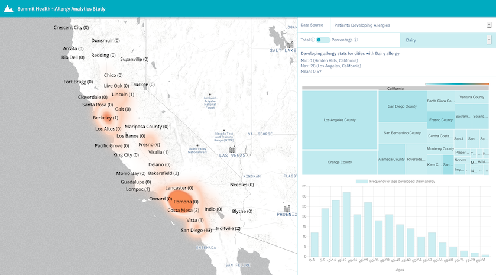
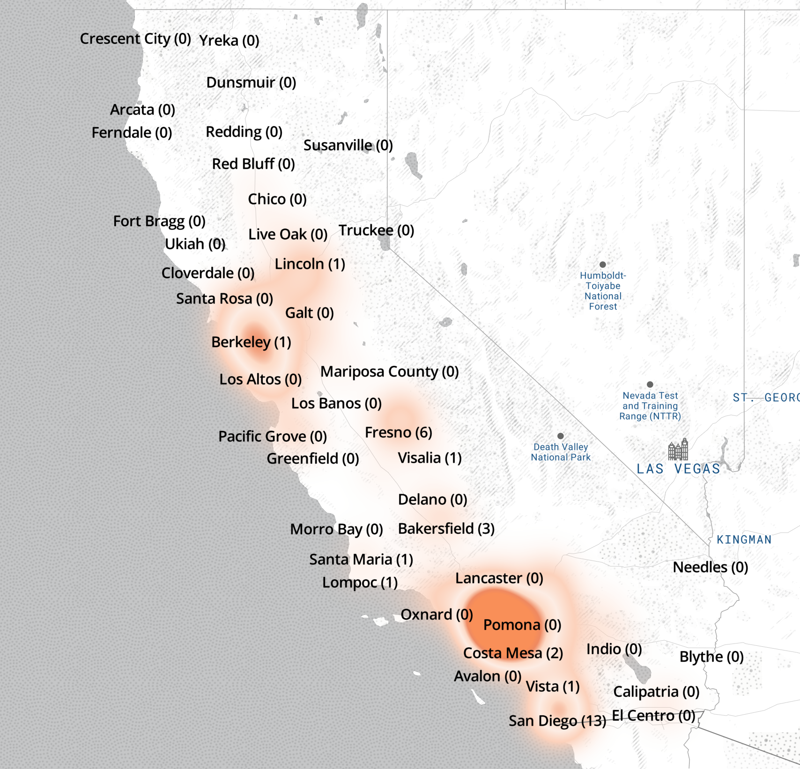
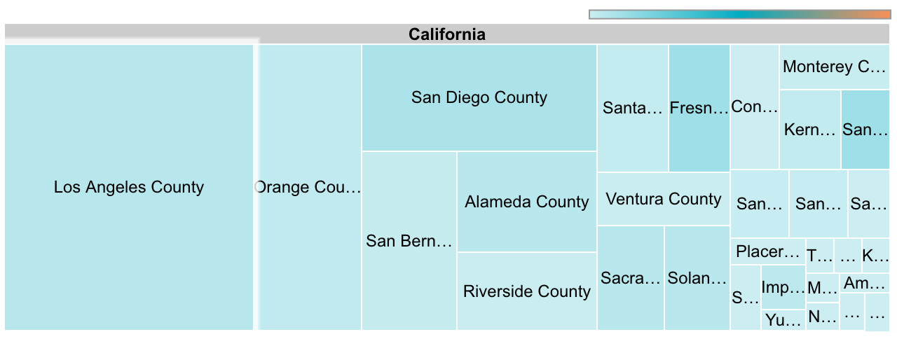
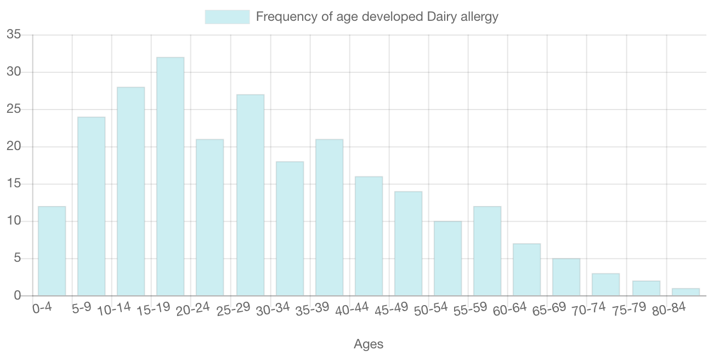

# Summit Health Analytics Front End

* [About](#about)
* [Analytics](#analytics)
* [Visuals](#visuals)

# About

This part of Summit Health Analytics is responsible for calculating and displaying analytics on the paitent/allergy data stored in the MongoDB data lake.

# Analytics

There are two main groups of analytics being calculated from the data lake: Population and Allergy statistics.

## Population

The population statistics are looked at from a city level and include both people with and without allergies.

__Data Structure__

```
{
    cities: [{
        city: String,
        state: String,
        percentage: Float,
        population: Int
    }],
    min: {
        city: String,
        state: String,
        percentage: Float,
        population: Int
    },
    max: {
        city: String,
        state: String,
        percentage: Float,
        population: Int
    },
    mean: Float
}
```

* **cities**: A list of cities where each city includes:
    * **city**: The name of a city
    * **state**: The name of a state a city is in
    * **percentage**: The percentage of the state's population that represents a city's population
    * **population**: The total population for a city
* **min**: The city with the minimum population
* **max**: The city with the maximum population
* **mean**: The average population of cities in a state

## Allergy

The allergy statistics are looked at from a city level. The statisitcs focus on specific allergies (developed and outgrown).

__Data Structure__

```
{
    cities: [{
        city: String,
        state: String,
        allergies: [{
            allergy: String,
            type: String,
            outgrown: {
                total: Int,
                percentage: Float,
                ages: [Int]
            },
            developed: {
                total: Int,
                percentage: Float,
                ages: [Int]
            }
        }]
    }],
    stats: {
        outgrown: [{
            allergy: String,
            min: {
                total: {
                    city: String,
                    state: String, 
                    min: Int
                },
                percentage: {
                    city: String, 
                    state: String, 
                    min: Float
                }
            },
            max: {
                total: {
                    city: String, 
                    state: String, 
                    max: Int
                },
                percentage: {
                    city: String, 
                    state: String, 
                    max: Float
                }
            },
            mean: {
                total: Float,
                percentage: Float
            }
        }],
        developed: [{
            allergy: String,
            min: {
                total: {
                    city: String, 
                    state: String, 
                    min: Int
                },
                percentage: {
                    city: String, 
                    state: String, 
                    min: Float
                }
            },
            max: {
                total: {
                    city: String, 
                    state: String, 
                    max: Int
                },
                percentage: {
                    city: String, 
                    state: String, 
                    max: Float
                }
            },
            mean: {
                total: Float,
                percentage: Float
            }
        }]
    }
}
```

* **cities**: A list of cities where each city includes:
    * **city**: The name of a city
    * **state**: The name of a state a city is in
    * **allergies**: A list of alleriges for a city that includes:
        * **allergy**: The name of the allergy
        * **type**: The type of the allergy
        * **outgrown**: City population that have outgrown an allergy that includes:
            * **total**: The total city population that has outgrown an allergy
            * **percentage**: The percentage of a city population that has an allergy that outgrew the allergy
            * **ages**: A list of the ages of a city population that outgrew an allergy
        * **developed**: City population that have developed an allergy that includes:
            * **total**: The total city population that has developed an allergy
            * **percentage**: The percentage of a city population that has developed an allergy
            * **ages**: A list of the ages of a city population that has developed an allergy
* **stats**: Minimum, maximum, and mean stats for the following:
    > NOTE: Stats are broken down by total and percentage, because they may not both refer to the same city

    * **outgrown**: A list of different allergies outgrown and their respective stats
    * **developed**: A list of different allergies developed and their respective stats

# Visuals

* [Map](#map)
* [Treemap](#treemap)
* [Bar Chart](#bar-chart)



## Map



The map is a [Mapbox](https://www.mapbox.com/) map that dsiplays the analytics data in the form of a [heatmap](https://docs.mapbox.com/mapbox-gl-js/example/heatmap-layer/). The number in parenthesis refers to the data for that city. The heat intensity when viewing `total` refers to the number of people for the selected data source. For `percentage`, the heat intensity refers to the percentage of people for the selected data source. For more information on the data you are viewing, hover over the information icons next to `total` and `percentage`.

## Treemap



The [treemap](https://developers.google.com/chart/interactive/docs/gallery/treemap) displays the analytics data broken down by the following layers: State, County, and City. The size and color of each element when viewing `total` refers to the number of people for the selected data source. For `percentage`, the size and color refers to the percentage of people for the selected data source. For more information on the data you are viewing, hover over the information icons next to `total` and `percentage`. In addition, hovering over each element on the treemap shows the data associated with that element.

## Bar Chart



The [bar chart](https://www.chartjs.org/docs/latest/charts/bar.html) is only viewable when the data source is developing/outgrowing allergies. The chart shows the frequency of the ages of people that developed/outgrew an allergy. The age ranges are broken down into 5 year periods.
